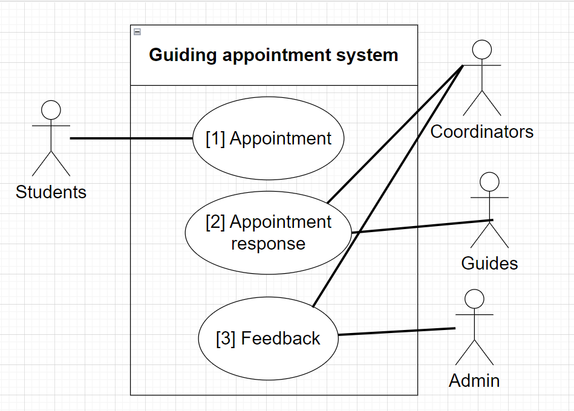
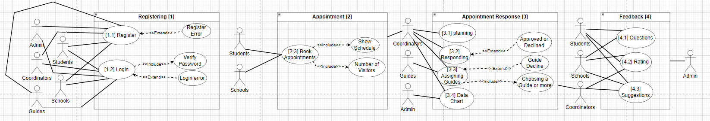

# Use Case Diagrams

## Level-0 Diagram

## Level-1 Diagram

---

# Non-functional requirements

## 1. Performance Requirements

- **Response Time**: The system shall ensure that appointment creation and data retrieval actions have a response time of no more than **2 seconds** under typical load conditions (up to **1000 users per day**).
- **Scalability**: The system must handle at least a **50% increase** in user traffic during peak periods without performance degradation.
- **Availability**: The system shall ensure **99.9% availability** during business hours (08:00 - 18:00) for consistent access by students and staff.

## 2. Security Requirements

- **Data Protection**: User data (personal information, feedback) shall be encrypted both at rest and in transit using **AES-256 encryption**.
- **Authentication**: Email/password login for regular users and **multi-factor authentication (MFA)** for admin users.
- **Access Control**: Only authorized Bilkent staff should access administrative functions such as managing appointments, viewing sensitive data, and visualizations.
- **Privacy**: The system will comply with Turkish data protection laws, ensuring no personal information is disclosed without user consent.

## 3. Usability Requirements

- **Ease of Use**: The user interface must be intuitive, enabling users to schedule appointments and access information within **3 clicks**.
- **Support and Help**: Help documentation and FAQs should be accessible from all pages of the user dashboard.
- **Accessibility**: The system shall conform to **WCAG 2.1 AA standards** to ensure accessibility for users with disabilities.

## 4. Reliability Requirements

- **Uptime**: The system shall maintain at least **99.9% uptime** during peak times, with a recovery time of no more than **5 minutes** in case of failure.
- **Error Handling**: Errors should be logged automatically, with the system attempting recovery within **2 seconds**. Appropriate error messages will be shown to users.

## 5. Portability and Compatibility Requirements

- **Browser Compatibility**: The system must support the latest versions of **Chrome, Firefox, Safari, and Edge**.
- **Device Support**: The system shall be responsive and fully functional on both **desktop and mobile devices**.

## 6. Maintainability Requirements

- **Modular Design**: The codebase shall follow a modular structure for easy updates and future modifications.
- **Documentation**: Full documentation for all system components, including **API documentation**, shall be provided to support future integration with university systems.

## 7. Scalability

- **Capacity**: The system must support up to **10,000 user accounts** and handle up to **500 concurrent users** without a performance drop.
- **Load Balancing**: The architecture will include **load balancing** to distribute traffic and prevent single points of failure during high-demand periods.

## Contact Information
For more information, reach out to the development team or consult the provided documentation.

# Tech Stack

## Frontend:

- **React** (TypeScript): We will use React for building an interactive and responsive user interface, ensuring scalability and maintainability. TypeScript will add type safety to our code, reducing bugs and improving development efficiency.

- **Tailwind CSS**: A utility-first CSS framework that will allow us to create responsive, custom-styled components quickly without writing much custom CSS, enhancing development speed and design flexibility.

## Backend:

- **Django** (Python): Django will serve as the backbone for our backend development. Known for its simplicity and powerful features, it will handle server-side logic, user authentication, and form management. Django's robust ecosystem provides various libraries and modules, ensuring fast, reliable development.

- **PostgreSQL**: PostgreSQL will be used as our primary database due to its reliability, scalability, and advanced features like support for complex queries, concurrency control, and extensive data types. It integrates well with Django, providing seamless database management.
